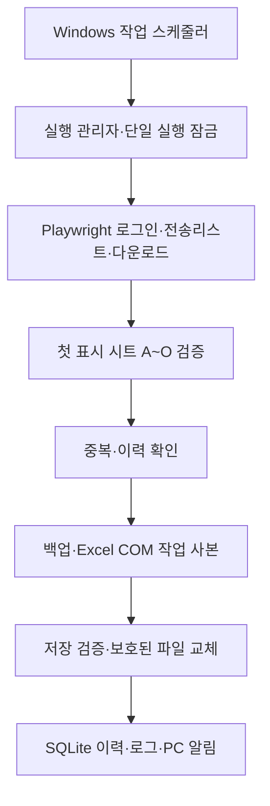

# 이마트24 일일 주문 자동화

## 구성



Python 3.12, Playwright, 설치된 Microsoft Edge, Microsoft Excel COM, SQLite를 사용한다. xlsx/xlsm은 openpyxl **읽기 전용**으로 검사하고 편집/저장은 Excel COM만 사용한다. `.xls`는 Excel에서 읽는다. 설치는 프로젝트 전용 `.venv`에 한정한다.

| 모듈 | 책임 |
|---|---|
| `core` | 제목·일자·유효 항목 선택, 값 정규화, 지문, 반복 횟수를 보존하는 중복 검사 |
| `site` | 프레임 로그인, 전송목록·페이지 탐색, 다운로드 완료 대기 |
| `workbooks` | 헤더/오류 셀 검사, 값 읽기, Excel 사본 편집, P~T 수식 검증 |
| `importer` | 백업·검증·교체 트랜잭션 |
| `ledger` | SQLite 처리 이력과 중단 복구 |
| `windows` | 파일 잠금, 자격 증명, 비차단 PC 알림 |
| `__main__` | CLI, 재시도, 예약 실행 시간 제한, 로깅 |

## 설치와 실행

Windows 사용자 로그인, Edge와 Excel 설치가 필요하다. 서비스 계정이나 로그아웃 상태의 Office 무인 실행은 지원하지 않는다.

```powershell
# 다른 PC에서 최초 설치할 때 Python 실행 파일을 지정한다.
.\scripts\setup.ps1 -Python 'C:\Python312\python.exe'

# 비밀번호는 이 로컬 창에서만 입력한다.
.\.venv\Scripts\python.exe -m emart24 configure
.\.venv\Scripts\python.exe -m emart24 credentials

# 첨부 원본을 이용한 미리보기
.\.venv\Scripts\python.exe -m emart24 run --date 2026-10-06 --source 'C:\Users\케이지에프앤비\Downloads\7F_자동전환양식_ver_4_20261006 (2).xlsx' --dry-run

# 실제 사이트에서 날짜별 다운로드와 미리보기 확인
.\.venv\Scripts\python.exe -m emart24 verify-site --date 2026-10-06

# 수동 운영 실행 / 당일 미리보기
.\.venv\Scripts\python.exe -m emart24 run --date 2026-10-07
.\.venv\Scripts\python.exe -m emart24 run --date 2026-10-07 --dry-run

# 검증·첫 운영 실행 이후 정기 작업 등록
.\scripts\register-task.ps1
```

`--config <경로>`는 `run` 등 하위 명령 앞에 둔다. 반환 코드는 정상/기적재/예약 시간 밖 0, 업무 검증 중단 2, 예상 밖 오류 3이다. 성공 결과는 JSON으로 출력한다. `--notify`로 수동 실행에도 PC 알림을 요청할 수 있다. Windows 알림 설정에 따라 말풍선이 표시되지 않을 수 있으며, 로그가 최종 기록이다.

등록 스크립트는 `check-ready`로 `site_verified.json`의 최종 설정 해시와 운영 파일 처리 이력을 확인하고, `show-config`로 수동 실행과 동일한 설정을 읽는다. PC별 경로 변경도 검증 해시를 무효화한다. 작업 이름은 `Emart24-CJ-DailyImport`. 매주 월~금 10:30 및 사용자 로그인 트리거를 등록하며 실제 프로그램은 한국시간 10:30~11:00 외의 실행을 건너뛴다. Windows 시간대도 한국 표준시인지 확인한다. 중복 인스턴스는 무시하고, 놓친 실행은 로그인 후 시간 창 안에서만 보충한다.

## 설정과 데이터 계약

`config.json`은 공통 설정, `config.local.json`은 PC별 대상 폴더 설정이다. 고정 파일명은 `core.TARGET_FILENAME` 한 곳에서 정의한다. `load_config`는 공통 설정 위에 로컬 `target_directory`를 적용해 최종 `target` 절대 경로를 만든다. 로컬 파일에는 `target_directory`만 허용한다. `--config other.json`을 사용하면 해당 폴더의 `other.local.json`이 적용된다.

새 PC에서는 `configure-target.cmd`로 폴더를 선택하거나 `configure --target-dir 'D:\업무자료\이마트24'`로 지정한다. 고정 파일명이 존재할 때만 설정을 저장하며 취소·검증 실패 시 기존 설정을 유지한다. 파일 자체를 이동하거나 이름을 변경하지 않는다. 설정이 없는 PC는 안내 후 중단한다. 기본 설정 위치는 프로그램 설치 폴더여서 실행 위치에 영향을 받지 않는다. 상대 경로는 설정 파일 폴더 기준이고 `%USERPROFILE%`, `$변수`, `~`를 확장한다. 다른 PC에서는 가상환경·자격 증명·예약 작업을 각각 준비한다.

나머지 공통 항목은 대상 시트(`sheet`), 작업 폴더(`runtime`), 자격 증명 이름, 시작/마감 시각, 재시도 간격, 원본 A~O 헤더 및 사이트 선택자다. 기존 전체 경로 `target` 설정은 고정 파일명이 맞는 경우에만 호환된다. `show-config`로 최종 적용 경로를 확인할 수 있다. 비밀번호는 설정에 넣지 않는다.

원본은 첫 표시된 시트를 사용한다. 첨부 파일의 숨김 시트에 잘못된 관계 정보가 있어 XML 읽기 경고가 나지만, 유효한 표시 시트만 읽으며 원본을 재저장하지 않는다. 현재 첨부 파일 헤더는 F=분류명, H=상품명이다. 사용자 지시에 따라 대상 헤더가 달라도 위치를 교환하지 않는다. 향후 수정된 헤더를 받은 경우 `source_headers`를 검토·갱신한다.

A~O 2행부터 끝의 빈 행만 제거한다. 중간 빈 행과 동일 주문의 반복은 유지한다. 문자열·숫자를 구분하고 코드 앞자리 0을 보존한다. xlsx/xlsm 수식은 저장된 계산 값을 읽으며 오류 값이나 없는 계산 캐시가 있으면 중단한다. 1904 날짜 체계는 변환 없이 중단한다.

DB 마지막 행은 A~O 실제 값 기준이다. 해당 다음 행부터 값만 추가하며 기존 마지막 행 서식을 복사하고 P~T의 R1C1 수식을 확장한다. 새 계산 결과가 비거나 오류면 운영 파일에 반영하지 않는다. 기존 외부 참조 오류는 새 오류와 구분하며 기존 수식을 임의로 고치지 않는다.

## 저장·중복·복구

`runtime/history.sqlite3`의 `runs` 테이블에는 실행 ID, 대상 경로, 처리일, 전송번호, 원본 해시, 데이터 지문, 상태, 시작 행, 행 수, 교체 전후 해시, 백업 경로, 생성 시각을 기록한다. 상태는 `existing`, `prepared`, `committed`, `aborted`다.

기존 데이터는 A~O 값의 행별 반복 횟수까지 비교한다. 모두 존재하면 적재하지 않고, 일부만 있으면 중단한다. 기존 성공 이력과 DB가 맞지 않거나 같은 날짜의 다른 자료라면 확인이 필요하다. 주문 단위 고유키가 아직 확정되지 않았으므로 행 내용의 일부가 겹치는 정상 자료도 보수적으로 확인 대상으로 남을 수 있다.

운영 파일에 대한 쓰기 방지 핸들을 유지한 채 백업하고 동일 폴더에 작업 사본을 만든다. 사본 편집/검증을 완료한 뒤 `prepared`를 커밋한다. 원본 해시·잠금 파일을 다시 확인하고 Windows `ReplaceFileW`로 보호 핸들을 유지한 채 교체한 다음 `committed`를 기록한다. 교체 함수에는 같은 폴더의 임시 원본 백업 경로도 전달한다. 드문 Windows 오류로 대상 이름이 사라졌을 때는 임시 원본 백업의 이름만 복원하며 이미 존재하는 대상은 덮어쓰지 않는다. 이력 확정 전 중단은 다음 실행에서 전후 해시와 추가 영역을 대조해 복구한다. 예상 밖 변경은 자동 덮어쓰기하지 않는다.

백업과 다운로드는 자동 삭제하지 않는다. `runtime/events.log`에는 단계 결과와 실패 원인을 기록하되 비밀번호와 주문별 행 내용은 기록하지 않는다. 개인정보가 포함될 수 있는 runtime 전체를 외부 공유하지 않는다.

복구 절차: 예약 작업을 중지하고 대상 Excel을 닫는다 → 현재 대상도 별도 보관한다 → 관련 `prepared` 이력과 백업/전후 해시를 대조한다 → 필요한 백업만 복원하고 처리 이력도 함께 검토한다 → 미리보기 후 재실행한다. SQLite 전체를 무작정 삭제하면 중복 판단 근거가 사라지므로 금지한다.

## 검증과 현재 연결 범위

- 단위 테스트는 항목 선택, 날짜/시간 경계, 중복 반복 횟수, 수정본, 저장 중단 복구를 검사한다.
- `tests/integration_excel.py`는 `runtime/validation/<실행 ID>`에만 시험 파일을 만들며 운영 파일 해시가 그대로인지 확인한다. 원본 샘플은 운영 DB에 이미 존재하는 사례를 전제로 한다.
- Excel 시험은 앞자리 0, 수식처럼 보이는 문자열, 파일 잠금, 교체 실패/복구, 백업, P~T 수식, 기존 모든 시트의 값/수식/표시 형식, 반복 실행을 검증한다.
- 로그인 화면 `topFrame`, `#userId`, `#passwd`, Login 버튼은 실제 화면에서 확인했다. 로그인 이후 테이블/페이지 탐색은 사용자 계정으로 검증해야 한다. ActiveX 전용 표·다운로드라면 별도 어댑터가 필요하며 자동으로 성공 처리하지 않는다.
- 목록 어댑터는 첨부 화면의 열 순서와 HTML 테이블을 기준으로 작성했다. 전체 건수와 탐색 건수가 다르면 최신 항목을 추정하지 않고 중단한다.
- `.xls` 경로는 실제 샘플이 없어 별도 호환성 검증 대상이다. 정기 등록은 로그인 검증 이전에 수행하지 않는다.

참고: [Playwright 다운로드](https://playwright.dev/python/docs/downloads), [Excel Value2](https://learn.microsoft.com/en-us/office/vba/api/excel.range.value2).
